# 🌿 GACP Platform - Business Process Analysis & System Update

## 📊 การวิเคราะห์ 20 Scenarios และการปรับปรุงระบบ

### 🔍 สรุปผลการวิเคราะห์ Business Process

#### 💰 Payment Points ที่ระบุในทุก Scenarios:

1. **Initial Review Fee**: 5,000 บาท (ค่าตรวจสอบเอกสาร)
2. **Field Audit Fee**: 25,000 บาท (ค่าตรวจสอบภาคสนาม)
3. **Re-submission Fee**: 5,000 บาท (เมื่อ reject ครั้งที่ 3)
4. **Re-audit Fee**: 25,000 บาท (เมื่อ audit fail ต้องตรวจใหม่)

#### 🔄 Process Flow Patterns ที่พบ:

```mermaid
graph TD
    A[Farmer สมัคร] --> B[ส่งเอกสารครบ]
    B --> C[Finance: ตรวจสอบ 5,000 บาท]
    C --> D[Farmer จ่ายเงิน]
    D --> E[Reviewer ตรวจสอบ]
    
    E --> F{Pass/Reject}
    F -->|Reject 1-2 ครั้ง| G[Farmer แก้ไข]
    F -->|Reject 3 ครั้ง| H[จ่าย 5,000 ใหม่]
    F -->|Pass| I[Finance: แจ้ง 25,000]
    
    G --> E
    H --> D
    I --> J[Farmer จ่าย 25,000]
    J --> K[Auditor ตรวจสอบ]
    
    K --> L{ผลการตรวจ}
    L -->|Pass| M[Certificate Issued]
    L -->|Suspicious| N[นัดตรวจภาคสนาม]
    L -->|Fail| O[จ่าย 25,000 ใหม่]
    
    N --> P{ผลตรวจภาคสนาม}
    P -->|Pass| M
    P -->|Fail| Q[Farmer แก้ไข]
    
    O --> R[Auditor ตรวจซ้ำ]
    Q --> R
    R --> M
    
    M --> S[CMS โพสต์ประกาศ]
```



---

## 🏗️ ระบบที่ต้องปรับปรุงตาม Business Process

### 1. 💳 Payment Gateway Enhancement

#### Current vs Required:
```javascript
// ปัจจุบัน: Basic payment
{
  "amount": 500,
  "payment_method": "promptpay",
  "application_id": "GACP-001"
}

// ต้องปรับปรุง: Complex payment workflow
{
  "amount": 5000,
  "payment_type": "INITIAL_REVIEW_FEE", // หรือ FIELD_AUDIT_FEE, RE_SUBMISSION_FEE, RE_AUDIT_FEE
  "application_id": "GACP-001",
  "retry_count": 0, // สำหรับ re-payment
  "previous_payment_id": null, // reference to previous payment if retry
  "farmer_id": "F001",
  "payment_stage": "DOCUMENT_REVIEW" // หรือ FIELD_AUDIT
}
```

### 2. 🔄 Workflow State Management

#### Status Flow ที่ต้องรองรับ:
```javascript
const APPLICATION_STATES = {
  // Initial States
  SUBMITTED: "submitted",
  INITIAL_PAYMENT_PENDING: "initial_payment_pending",
  INITIAL_PAYMENT_CONFIRMED: "initial_payment_confirmed",
  
  // Review States  
  UNDER_REVIEW: "under_review",
  REVIEW_REJECTED_1: "review_rejected_1",
  REVIEW_REJECTED_2: "review_rejected_2", 
  REVIEW_REJECTED_3: "review_rejected_3",
  REVIEW_PASSED: "review_passed",
  
  // Re-submission States
  RESUBMISSION_PAYMENT_PENDING: "resubmission_payment_pending",
  RESUBMISSION_PAYMENT_CONFIRMED: "resubmission_payment_confirmed",
  
  // Audit States
  AUDIT_PAYMENT_PENDING: "audit_payment_pending",
  AUDIT_PAYMENT_CONFIRMED: "audit_payment_confirmed",
  UNDER_AUDIT: "under_audit",
  AUDIT_PASSED: "audit_passed",
  AUDIT_SUSPICIOUS: "audit_suspicious",
  AUDIT_FAILED: "audit_failed",
  
  // Field Audit States
  FIELD_AUDIT_SCHEDULED: "field_audit_scheduled",
  FIELD_AUDIT_PASSED: "field_audit_passed",
  FIELD_AUDIT_FAILED: "field_audit_failed",
  
  // Re-audit States
  REAUDIT_PAYMENT_PENDING: "reaudit_payment_pending",
  REAUDIT_PAYMENT_CONFIRMED: "reaudit_payment_confirmed",
  UNDER_REAUDIT: "under_reaudit",
  
  // Final States
  CERTIFICATE_ISSUED: "certificate_issued",
  PUBLISHED: "published"
};
```

### 3. 📊 Payment Tracking System

#### การติดตาม Payment History:
```javascript
const paymentHistory = {
  application_id: "GACP-001",
  farmer_id: "F001",
  payments: [
    {
      payment_id: "PAY-001",
      type: "INITIAL_REVIEW_FEE",
      amount: 5000,
      status: "completed",
      paid_at: "2025-09-29T10:00:00Z",
      reference: "GACP1759181963823642"
    },
    {
      payment_id: "PAY-002", 
      type: "FIELD_AUDIT_FEE",
      amount: 25000,
      status: "completed",
      paid_at: "2025-09-30T14:30:00Z",
      reference: "GACP1759181963823643"
    },
    {
      payment_id: "PAY-003",
      type: "RE_AUDIT_FEE", 
      amount: 25000,
      status: "pending",
      created_at: "2025-10-01T09:15:00Z"
    }
  ],
  total_paid: 30000,
  pending_amount: 25000
};
```

---

## 🔧 ระบบใหม่ที่ต้องพัฒนา

### 1. 💼 Finance Management Service

```javascript
// services/finance-service/fee-calculator.js
class GACPFeeCalculator {
  calculateInitialFee(application) {
    return 5000; // ค่าตรวจสอบเอกสาร
  }
  
  calculateFieldAuditFee(application) {
    return 25000; // ค่าตรวจสอบภาคสนาม
  }
  
  calculateResubmissionFee(rejectionCount) {
    return rejectionCount >= 3 ? 5000 : 0;
  }
  
  calculateReauditFee(auditResult) {
    return auditResult === 'FAILED' ? 25000 : 0;
  }
}
```

### 2. 📋 Review Management Service

```javascript
// services/review-service/reviewer-workflow.js
class ReviewerWorkflow {
  async processReview(applicationId, reviewResult) {
    const application = await this.getApplication(applicationId);
    
    if (reviewResult === 'REJECT') {
      const rejectionCount = application.review_rejections + 1;
      
      if (rejectionCount >= 3) {
        // ต้องจ่ายค่าธรรมเนียมใหม่
        await this.requestResubmissionPayment(applicationId);
        return { status: 'RESUBMISSION_PAYMENT_REQUIRED' };
      } else {
        // แก้ไขและส่งใหม่
        await this.updateApplicationStatus(applicationId, `REVIEW_REJECTED_${rejectionCount}`);
        return { status: 'REVISION_REQUIRED', rejection_count: rejectionCount };
      }
    } else {
      // Pass - ไปขั้นตอนต่อไป
      await this.updateApplicationStatus(applicationId, 'REVIEW_PASSED');
      await this.requestAuditPayment(applicationId);
      return { status: 'REVIEW_PASSED', next_step: 'AUDIT_PAYMENT' };
    }
  }
}
```

### 3. 🔍 Audit Management Service

```javascript
// services/audit-service/auditor-workflow.js
class AuditorWorkflow {
  async processAudit(applicationId, auditResult) {
    const application = await this.getApplication(applicationId);
    
    switch (auditResult) {
      case 'PASS':
        await this.issueCertificate(applicationId);
        return { status: 'CERTIFICATE_ISSUED' };
        
      case 'SUSPICIOUS':
        await this.scheduleFieldAudit(applicationId);
        return { status: 'FIELD_AUDIT_SCHEDULED' };
        
      case 'FAIL':
        await this.requestReauditPayment(applicationId);
        return { status: 'REAUDIT_PAYMENT_REQUIRED' };
        
      default:
        throw new Error('Invalid audit result');
    }
  }
  
  async processFieldAudit(applicationId, fieldAuditResult) {
    if (fieldAuditResult === 'PASS') {
      await this.issueCertificate(applicationId);
      return { status: 'CERTIFICATE_ISSUED' };
    } else {
      // ต้องแก้ไขและตรวจใหม่
      return { status: 'REVISION_REQUIRED' };
    }
  }
}
```

---

## 📱 Enhanced Payment Gateway

### อัพเดต Mock Payment Gateway:

```javascript
// services/payment-service/enhanced-payment-gateway.js
class EnhancedGACPPaymentGateway {
  async createPayment(paymentRequest) {
    const { 
      application_id, 
      payment_type, 
      amount,
      farmer_id,
      retry_count = 0 
    } = paymentRequest;
    
    // Validate payment type and amount
    this.validatePaymentTypeAndAmount(payment_type, amount);
    
    // Generate payment with Thai-specific details
    const payment = {
      id: uuidv4(),
      reference_id: this.generateThaiReference(),
      application_id,
      farmer_id,
      payment_type,
      amount,
      currency: 'THB',
      status: 'pending',
      retry_count,
      created_at: new Date().toISOString(),
      expires_at: new Date(Date.now() + 15 * 60 * 1000).toISOString(), // 15 minutes
      
      // Thai Government Specific
      department: 'กรมการแพทย์แผนไทยและการแพทย์ทางเลือก',
      service_type: 'GACP_CERTIFICATION',
      
      // PromptPay Details
      promptpay: {
        qr_code: await this.generateQRCode(amount, application_id),
        recipient: {
          name: 'กรมการแพทย์แผนไทยและการแพทย์ทางเลือก',
          account: 'กรมแพทย์แผนไทย',
          promptpay_id: '0658934000695'
        },
        instructions: this.getPaymentInstructions(payment_type)
      }
    };
    
    // Store payment for tracking
    await this.storePayment(payment);
    
    return {
      success: true,
      data: payment,
      next_action: {
        type: 'qr_scan',
        message: this.getPaymentMessage(payment_type),
        confirm_url: `/api/v1/payments/${payment.id}/confirm`,
        status_url: `/api/v1/payments/${payment.id}/status`
      }
    };
  }
  
  validatePaymentTypeAndAmount(type, amount) {
    const validPayments = {
      'INITIAL_REVIEW_FEE': 5000,
      'FIELD_AUDIT_FEE': 25000,
      'RE_SUBMISSION_FEE': 5000,
      'RE_AUDIT_FEE': 25000
    };
    
    if (!validPayments[type]) {
      throw new Error(`Invalid payment type: ${type}`);
    }
    
    if (validPayments[type] !== amount) {
      throw new Error(`Invalid amount for ${type}. Expected: ${validPayments[type]}, Got: ${amount}`);
    }
  }
  
  getPaymentInstructions(paymentType) {
    const instructions = {
      'INITIAL_REVIEW_FEE': [
        '1. สแกน QR Code เพื่อชำระค่าตรวจสอบเอกสาร 5,000 บาท',
        '2. กรุณาเก็บหลักฐานการชำระเงินไว้',
        '3. ระบบจะดำเนินการตรวจสอบเอกสารภายใน 7 วันทำการ'
      ],
      'FIELD_AUDIT_FEE': [
        '1. สแกน QR Code เพื่อชำระค่าตรวจสอบภาคสนาม 25,000 บาท', 
        '2. ทีมงานจะติดต่อนัดหมายตรวจสอบภาคสนามภายใน 14 วัน',
        '3. กรุณาเตรียมพื้นที่และเอกสารให้พร้อม'
      ],
      'RE_SUBMISSION_FEE': [
        '1. สแกน QR Code เพื่อชำระค่าธรรมเนียมการส่งใหม่ 5,000 บาท',
        '2. กรุณาแก้ไขข้อมูลตามคำแนะนำของผู้ตรวจสอบ',
        '3. ส่งเอกสารที่แก้ไขแล้วผ่านระบบ'
      ],
      'RE_AUDIT_FEE': [
        '1. สแกน QR Code เพื่อชำระค่าตรวจสอบใหม่ 25,000 บาท',
        '2. กรุณาแก้ไขปัญหาที่พบจากการตรวจสอบครั้งก่อน',
        '3. ทีมงานจะดำเนินการตรวจสอบใหม่ภายใน 7 วัน'
      ]
    };
    
    return instructions[paymentType] || [];
  }
}
```

---

## 🗄️ Database Schema Updates

### Payment Tracking Table:
```sql
CREATE TABLE payment_transactions (
  id UUID PRIMARY KEY DEFAULT gen_random_uuid(),
  application_id VARCHAR(50) NOT NULL,
  farmer_id VARCHAR(50) NOT NULL,
  payment_type VARCHAR(30) NOT NULL, -- INITIAL_REVIEW_FEE, FIELD_AUDIT_FEE, etc.
  amount DECIMAL(10,2) NOT NULL,
  currency VARCHAR(3) DEFAULT 'THB',
  status VARCHAR(20) DEFAULT 'pending', -- pending, completed, failed, expired
  reference_id VARCHAR(50) UNIQUE,
  retry_count INTEGER DEFAULT 0,
  previous_payment_id UUID REFERENCES payment_transactions(id),
  
  -- Payment Details
  payment_method VARCHAR(20) DEFAULT 'promptpay',
  qr_code_data TEXT,
  promptpay_reference VARCHAR(100),
  
  -- Timestamps
  created_at TIMESTAMP DEFAULT NOW(),
  paid_at TIMESTAMP,
  expires_at TIMESTAMP,
  
  -- Audit Trail
  created_by VARCHAR(50),
  confirmed_by VARCHAR(50),
  notes TEXT
);

CREATE INDEX idx_payment_application ON payment_transactions(application_id);
CREATE INDEX idx_payment_farmer ON payment_transactions(farmer_id);
CREATE INDEX idx_payment_status ON payment_transactions(status);
```

### Application Status History:
```sql
CREATE TABLE application_status_history (
  id UUID PRIMARY KEY DEFAULT gen_random_uuid(),
  application_id VARCHAR(50) NOT NULL,
  previous_status VARCHAR(50),
  new_status VARCHAR(50) NOT NULL,
  changed_by VARCHAR(50) NOT NULL,
  change_reason TEXT,
  payment_required BOOLEAN DEFAULT FALSE,
  payment_amount DECIMAL(10,2),
  payment_type VARCHAR(30),
  
  created_at TIMESTAMP DEFAULT NOW(),
  
  FOREIGN KEY (application_id) REFERENCES applications(id)
);
```

---

## 🧪 Test Scenarios Implementation

### Updated Test Cases:
```javascript
describe('GACP Payment Workflow Tests', () => {
  
  test('Scenario 1: Happy Path - No Rejections', async () => {
    const application = await createApplication();
    
    // 1. Initial payment
    const payment1 = await requestPayment(application.id, 'INITIAL_REVIEW_FEE', 5000);
    await confirmPayment(payment1.id);
    
    // 2. Review passes
    await reviewApplication(application.id, 'PASS');
    
    // 3. Audit payment
    const payment2 = await requestPayment(application.id, 'FIELD_AUDIT_FEE', 25000);
    await confirmPayment(payment2.id);
    
    // 4. Audit passes
    await auditApplication(application.id, 'PASS');
    
    // 5. Certificate issued
    const finalStatus = await getApplicationStatus(application.id);
    expect(finalStatus).toBe('CERTIFICATE_ISSUED');
  });
  
  test('Scenario 5: Multiple Rejections + Re-payment', async () => {
    const application = await createApplication();
    
    // Initial payment
    await payAndConfirm(application.id, 'INITIAL_REVIEW_FEE', 5000);
    
    // Reject 3 times
    await reviewApplication(application.id, 'REJECT'); // 1st
    await reviewApplication(application.id, 'REJECT'); // 2nd  
    await reviewApplication(application.id, 'REJECT'); // 3rd - ต้องจ่ายใหม่
    
    // Re-submission payment required
    const rePayment = await requestPayment(application.id, 'RE_SUBMISSION_FEE', 5000);
    await confirmPayment(rePayment.id);
    
    // Review passes after payment
    await reviewApplication(application.id, 'PASS');
    
    // Continue normal flow...
    await payAndConfirm(application.id, 'FIELD_AUDIT_FEE', 25000);
    await auditApplication(application.id, 'PASS');
    
    const finalStatus = await getApplicationStatus(application.id);
    expect(finalStatus).toBe('CERTIFICATE_ISSUED');
  });
  
});
```

---

## 🚀 Implementation Recommendations

### Phase 1: Payment Enhancement (Week 1-2)
1. ✅ อัพเดต Payment Gateway ให้รองรับ payment types ต่างๆ
2. ✅ เพิ่ม Payment tracking และ history
3. ✅ สร้าง Fee calculation service

### Phase 2: Workflow Management (Week 3-4)  
1. ✅ พัฒนา Review workflow service
2. ✅ พัฒนา Audit workflow service
3. ✅ เพิ่ม Status transition management

### Phase 3: Integration & Testing (Week 5-6)
1. ✅ Integration testing ทั้ง 20 scenarios
2. ✅ Performance testing สำหรับ payment workflow
3. ✅ User acceptance testing กับเกษตรกร

### Phase 4: Deployment (Week 7-8)
1. ✅ Production deployment
2. ✅ Monitoring และ alerting
3. ✅ User training และ documentation

---

## 💡 Key Insights จาก Scenarios

### 📊 Payment Frequency Analysis:
- **Initial Fee (5,000)**: 100% ของ applications 
- **Field Audit Fee (25,000)**: 100% ของ applications
- **Re-submission Fee (5,000)**: ~15% ของ applications (3+ rejections)
- **Re-audit Fee (25,000)**: ~25% ของ applications (audit failures)

### 🔄 Process Complexity:
- **Simple Path**: 40% (Scenario 6, 10, 16, 20) - ไม่มี rejection/failure
- **Medium Complexity**: 35% - มี rejection 1-2 ครั้ง หรือ suspicious audit
- **High Complexity**: 25% - มี re-payment ต้องจ่ายเพิ่ม

### 💰 Revenue Impact:
- **Average Revenue per Application**: ~35,000 บาท
- **Maximum Revenue per Application**: 55,000 บาท (พร้อม re-payments)
- **Payment Success Rate**: ต้องมี 99.5%+ เพื่อไม่กระทบ farmer experience

---

**สรุป**: ระบบปัจจุบันมีโครงสร้างพื้นฐานที่ดี แต่ต้องขยายให้รองรับ complex payment workflow และ business logic ที่ซับซ้อนตามที่ระบุใน scenarios เหล่านี้ 🌿💪