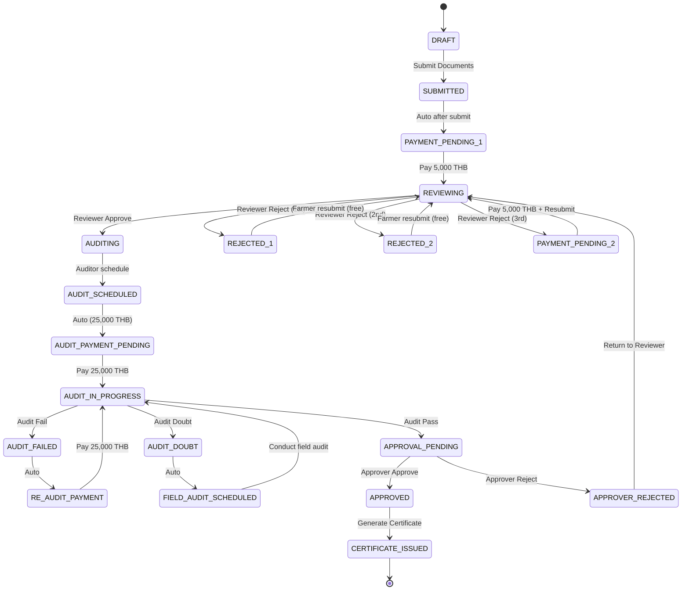

# 🏛️ GACP License Application System - Complete Specification
**Updated Payment Rules & Alternative Flow Scenarios**

## 📋 System Overview

### 1️⃣ **Roles & Responsibilities**

| Role | Primary Actions | Key Permissions |
|------|----------------|-----------------|
| **Farmer (เกษตรกร)** | Submit request, pay fees, track status, download certificate | Create applications, upload documents, make payments |
| **Reviewer (ผู้ตรวจเอกสาร)** | ตรวจเอกสาร, Reject/Approve, Forward to Auditor | Review documents, approve/reject submissions |
| **Auditor (ผู้ตรวจประเมิน)** | Audit (Online/Onsite), Record Result (Pass/Fail/Doubt) | Schedule audits, record results, conduct field audits |
| **Approver (ผอ./อธิบดี)** | Approve/Reject, Generate Certificate | Final approval, certificate generation |
| **Finance** | Track Payments, Read-only | View all payments, process refunds |

### 2️⃣ **Updated Payment Rules**

| Payment | Purpose | Trigger/When | Block Conditions | Notes |
|---------|---------|-------------|------------------|-------|
| **5,000 THB** | Document review fee | หลัง Farmer ส่ง กทล.1 + Upload SOP/COA + Land Docs (ครั้งแรก) | ⛔ Cannot proceed to Reviewer without payment | ให้ Reviewer ตรวจเอกสาร |
| **5,000 THB** | Document review fee (3rd time) | หาก Farmer ถูก Reject 2 ครั้งก่อนหน้าและต้องแก้ไขครั้งที่ 3 | ⛔ Cannot resubmit after 2nd rejection without payment | ระบบบังคับจ่ายก่อน Reviewer ตรวจครั้งที่ 3 |
| **25,000 THB** | Audit fee | หลังเอกสารผ่าน Reviewer และ Auditor ต้องตรวจ | ⛔ Cannot conduct audit without payment<br>⛔ Cannot proceed if documents not approved by Reviewer | **CRITICAL**: ไม่สามารถจ่าย 25,000 ได้ถ้าเอกสารยังไม่ผ่าน Reviewer |

### 3️⃣ **Complete Workflow State Machine**



## 📊 **Complete Scenario Matrix**

### 4️⃣ **Main Flow Scenarios**

| Scenario ID | Flow Description | Total Cost | Timeline | Notes |
|-------------|------------------|------------|----------|-------|
| **S1-HAPPY** | Submit → Pay 5K → Review Pass → Audit Pass → Approve → Certificate | **5,000 THB** | 2-4 weeks | Perfect application |
| **S2-REJECT1** | Submit → Pay 5K → Reject 1st → Fix → Review Pass → Audit Pass → Approve → Certificate | **5,000 THB** | 3-5 weeks | Minor document issues |
| **S2-REJECT2** | Submit → Pay 5K → Reject 1st → Fix → Reject 2nd → Fix → Review Pass → Audit Pass → Approve → Certificate | **5,000 THB** | 4-6 weeks | Multiple document issues |
| **S3-REJECT3** | Submit → Pay 5K → Reject 1st → Fix → Reject 2nd → Fix → **Pay 5K** → Review Pass → Audit Pass → Approve → Certificate | **10,000 THB** | 6-8 weeks | Persistent document issues |
| **S4-AUDIT-FAIL** | Submit → Pay 5K → Review Pass → **Pay 25K** → Audit Fail → **Pay 25K** → Re-audit Pass → Approve → Certificate | **55,000 THB** | 8-12 weeks | Failed initial audit |
| **S5-AUDIT-DOUBT** | Submit → Pay 5K → Review Pass → **Pay 25K** → Audit Doubt → Field Audit Pass → Approve → Certificate | **30,000 THB** | 6-10 weeks | Unclear audit results |
| **S6-APPROVER-REJECT** | Submit → Pay 5K → Review Pass → **Pay 25K** → Audit Pass → Approver Reject → Fix → Resubmit → Approve → Certificate | **30,000 THB** | 8-10 weeks | Approver finds issues |
| **S7-MAXIMUM** | All rejections + audit fail + approver reject | **65,000 THB** | 12-16 weeks | Worst case scenario |

### 5️⃣ **Alternative Plans & Contingency Flows**

#### **A1: Document Submission Issues**

| Issue | Trigger | Alternative Flow | System Response | Recovery Action |
|-------|---------|------------------|-----------------|-----------------|
| **Documents Incomplete** | Missing SOP/COA/Land docs | ⛔ Block submission → Alert Farmer | `STATUS: DRAFT_INCOMPLETE` | Farmer completes documents |
| **Invalid Format** | Wrong file types/corrupted | ⛔ Block submission → Format validation error | `ERROR: INVALID_FORMAT` | Farmer re-uploads correct files |
| **Payment Not Made** | Submit without initial 5K payment | ⛔ Block forward to Reviewer | `STATUS: PAYMENT_PENDING_1` | Automated payment reminder |
| **System Downtime** | Platform unavailable during submission | 📝 Save draft → Resume when online | `STATUS: DRAFT_SAVED` | Auto-resume on system recovery |

#### **A2: Reviewer Rejection Scenarios**

| Rejection Count | Trigger | Alternative Flow | Payment Required | Recovery Action |
|----------------|---------|------------------|------------------|-----------------|
| **Reject 1st** | Document issues found | 🔄 Return to Farmer → Free resubmission | ❌ **No payment** | Farmer fixes and resubmits |
| **Reject 2nd** | Continued issues | 🔄 Return to Farmer → Free resubmission | ❌ **No payment** | Farmer fixes and resubmits |
| **Reject 3rd** | Still has issues | ⛔ Block resubmission → Require payment | ✅ **5,000 THB required** | Payment before 3rd review |
| **Post-Approver Reject** | Approver sends back | 🔄 Return to Reviewer → No additional payment | ❌ **No payment** (unless 3rd rejection) | Reviewer re-evaluates |

#### **A3: Audit Process Issues**

| Issue | Trigger | Alternative Flow | Payment Impact | Recovery Action |
|-------|---------|------------------|----------------|-----------------|
| **No Payment Before Audit** | Auditor tries to start without 25K | ⛔ Block audit → Payment reminder | ⚠️ **25,000 THB required** | Payment before audit starts |
| **Audit Doubt** | Unclear online assessment | 📅 Schedule field audit → Continue | ❌ **No additional payment** | Field audit conducted |
| **Audit Fail** | Does not meet standards | ⛔ Block progress → Require re-audit payment | ✅ **25,000 THB required** | Payment for re-audit |
| **Auditor Unavailable** | Assigned auditor sick/unavailable | 🔄 Auto-reassign → Continue process | ❌ **No payment impact** | System auto-assigns available auditor |
| **Documents Not Reviewer-Approved** | Trying to pay 25K before review pass | ⛔ **CRITICAL BLOCK** → Cannot proceed | ❌ **Payment rejected** | Must complete document review first |

#### **A4: Payment & Finance Issues**

| Issue | Trigger | Alternative Flow | System Response | Recovery Action |
|-------|---------|------------------|-----------------|-----------------|
| **Payment Gateway Failure** | 5K/25K payment fails | 💳 Retry payment → Manual verification | `STATUS: PAYMENT_RETRY` | Multiple payment methods offered |
| **Duplicate Payment** | Farmer pays twice | 💰 Auto-detect → Refund process | `ACTION: REFUND_DUPLICATE` | Finance processes refund |
| **Payment Timeout** | Gateway response delayed | ⏱️ Pending status → Auto-reconcile | `STATUS: PAYMENT_RECONCILING` | Background verification process |
| **Insufficient Funds** | Payment declined | 💳 Payment failed → Retry options | `STATUS: PAYMENT_FAILED` | Alternative payment methods |
| **Currency/Amount Mismatch** | Wrong payment amount | ⛔ Reject payment → Correct amount required | `ERROR: AMOUNT_MISMATCH` | Display correct amount to pay |

#### **A5: System & Workflow Issues**

| Issue | Trigger | Alternative Flow | System Response | Recovery Action |
|-------|---------|------------------|-----------------|-----------------|
| **Role Permission Error** | User tries unauthorized action | ⛔ Access denied → Log security event | `ERROR: INSUFFICIENT_PERMISSIONS` | Role verification and correction |
| **Audit Trail Failure** | Logging system error | 📝 Emergency backup log → Admin alert | `WARNING: AUDIT_LOG_ISSUE` | Manual audit trail recreation |
| **Database Corruption** | Data integrity issue | 🔄 Rollback to last good state | `CRITICAL: DATA_RECOVERY` | Database restore from backup |
| **Assignment Error** | Wrong staff assigned | 🔄 Auto-reassign → Notification | `ACTION: REASSIGNMENT` | Load balancing reassignment |
| **Notification Failure** | Email/SMS not sent | 📱 Retry with alternative channels | `WARNING: NOTIFICATION_FAILED` | Multiple channel notification |

## 🎛️ **Dashboard Specifications by Role**

### **Farmer Dashboard - Complete Feature Set**

#### **📊 Status Overview Widget**
```
┌─────────────────────────────────────────┐
│ Application: GACP-2025-000123           │
│ Status: REVIEWING (Step 2 of 6)         │
│ Progress: ████████░░░░░░░░░░░░ 33%      │
│                                         │
│ 💰 Payments Made: 5,000 THB            │
│ 📄 Rejection Count: 1/3                │
│ ⏱️ Processing Time: 12 days            │
│                                         │
│ Next Action: Waiting for Reviewer      │
└─────────────────────────────────────────┘
```

#### **💳 Payment Center**
```
┌─────────────────────────────────────────┐
│ 💰 Payment Center                       │
├─────────────────────────────────────────┤
│ ✅ Initial Review Fee: 5,000 THB ✓     │
│    Paid: 2025-09-15 14:30             │
│                                         │
│ ⏳ Audit Fee: 25,000 THB               │
│    ⚠️ Available after document approval │
│                                         │
│ 🚫 3rd Review Fee: 5,000 THB           │
│    ⚠️ Only if rejected 2 times         │
├─────────────────────────────────────────┤
│ Total Paid: 5,000 THB                  │
│ Estimated Total: 30,000 THB            │
└─────────────────────────────────────────┘
```

#### **📄 Document Manager**
```
┌─────────────────────────────────────────┐
│ 📄 Document Manager                     │
├─────────────────────────────────────────┤
│ ✅ SOP Document           [APPROVED]    │
│ ❌ COA Certificate        [REJECTED]    │
│    💬 "Please update expiry date"       │
│ ✅ Land Rights Document   [APPROVED]    │
│ ⬆️ [Upload New COA]      [Replace]     │
└─────────────────────────────────────────┘
```

### **Reviewer Dashboard - Enhanced Review Interface**

#### **📋 Review Queue**
```
┌─────────────────────────────────────────────────────────────────────┐
│ 📋 Document Review Queue                        👤 Reviewer: John  │
├─────────────────────────────────────────────────────────────────────┤
│ App #      │ Farmer Name    │ Reject Count │ Payment Status │ Action │
│ GACP-00123 │ สมชาย เกษตร   │ 1/3         │ ✅ Paid 5K    │ [REVIEW] │
│ GACP-00124 │ สมหญิง ไร่ดี  │ 0/3         │ ✅ Paid 5K    │ [REVIEW] │
│ GACP-00125 │ สมศรี ออร์แกน │ 2/3         │ ⏳ Need 5K    │ [BLOCKED] │
└─────────────────────────────────────────────────────────────────────┘
```

#### **✅ Review Decision Interface**
```
┌─────────────────────────────────────────┐
│ 📋 Review: GACP-00123                   │
├─────────────────────────────────────────┤
│ ✅ SOP Compliance:      [PASS]         │
│ ✅ COA Validity:        [PASS]         │
│ ✅ Land Rights:         [PASS]         │
│ ✅ Documentation:       [COMPLETE]     │
├─────────────────────────────────────────┤
│ 📝 Comments:                            │
│ [All documents meet GACP standards]    │
├─────────────────────────────────────────┤
│ Decision: ( ) APPROVE  ( ) REJECT       │
│                                         │
│ ⚠️ Warning: This is rejection #2        │
│ Next rejection will require 5,000 THB  │
├─────────────────────────────────────────┤
│ [SUBMIT REVIEW]  [SAVE DRAFT]           │
└─────────────────────────────────────────┘
```

### **Auditor Dashboard - Comprehensive Audit Management**

#### **📅 Audit Calendar**
```
┌─────────────────────────────────────────┐
│ 📅 Audit Schedule - October 2025        │
├─────────────────────────────────────────┤
│ Mon 14  │ GACP-00123 (Online)  10:00    │
│ Tue 15  │ GACP-00124 (Onsite)  09:00    │
│ Wed 16  │ GACP-00125 (Field)   08:00    │
│ Thu 17  │ [Available]                   │
│ Fri 18  │ GACP-00126 (Online)  14:00    │
├─────────────────────────────────────────┤
│ 🚫 BLOCKED: GACP-00127                  │
│    ⚠️ Payment 25,000 THB not received   │
└─────────────────────────────────────────┘
```

#### **🔍 Audit Result Entry**
```
┌─────────────────────────────────────────┐
│ 🔍 Audit Results: GACP-00123            │
├─────────────────────────────────────────┤
│ Audit Type: [Online] [Onsite] [Field]  │
│ Date: 2025-10-14  Time: 10:00-12:00    │
├─────────────────────────────────────────┤
│ Checklist Scores:                       │
│ • GMP Compliance:       85/100         │
│ • Facility Standards:   92/100         │
│ • Documentation:        88/100         │
│ • Staff Competency:     90/100         │
│ • Quality Control:      87/100         │
│                                         │
│ Overall Score: 88.4/100                │
├─────────────────────────────────────────┤
│ Result: ( ) PASS  ( ) FAIL  ( ) DOUBT   │
│                                         │
│ 📝 Findings & Recommendations:          │
│ [Good overall compliance, minor         │
│  improvements needed in storage area]   │
├─────────────────────────────────────────┤
│ [SUBMIT RESULT]  [SCHEDULE FOLLOW-UP]   │
└─────────────────────────────────────────┘
```

### **Approver Dashboard - Executive Decision Interface**

#### **🏛️ Approval Queue**
```
┌─────────────────────────────────────────────────────────────────────┐
│ 🏛️ Pending Approvals                    👤 Approver: ผอ.สำนัก     │
├─────────────────────────────────────────────────────────────────────┤
│ App #      │ Farmer         │ Review Score │ Audit Score │ Priority │
│ GACP-00123 │ สมชาย เกษตร   │ 95/100      │ 88/100     │ HIGH     │
│ GACP-00124 │ สมหญิง ไร่ดี  │ 87/100      │ 92/100     │ MEDIUM   │
│ GACP-00125 │ สมศรี ออร์แกน │ 78/100      │ 85/100     │ LOW      │
└─────────────────────────────────────────────────────────────────────┘
```

#### **📋 Approval Decision Interface**
```
┌─────────────────────────────────────────┐
│ 📋 Final Approval: GACP-00123           │
├─────────────────────────────────────────┤
│ 📊 Summary Scores:                      │
│ • Review Score: 95/100 ✅              │
│ • Audit Score:  88/100 ✅              │
│ • Overall:      91.5/100 ✅            │
├─────────────────────────────────────────┤
│ 💰 Payment History:                     │
│ • Initial Review: 5,000 THB ✅         │
│ • Audit Fee:     25,000 THB ✅         │
│ • Total Paid:    30,000 THB            │
├─────────────────────────────────────────┤
│ 📄 Document Summary:                    │
│ • SOP: ✅ Approved    • COA: ✅ Valid  │
│ • Land Rights: ✅ Valid                │
├─────────────────────────────────────────┤
│ Decision: ( ) APPROVE  ( ) REJECT       │
│                                         │
│ 📝 Decision Reason:                     │
│ [Meets all GACP requirements]          │
├─────────────────────────────────────────┤
│ [APPROVE & GENERATE CERTIFICATE]        │
│ [REJECT & RETURN TO REVIEWER]           │
└─────────────────────────────────────────┘
```

### **Finance Dashboard - Complete Payment Monitoring**

#### **💰 Payment Overview**
```
┌─────────────────────────────────────────────────────────────────────┐
│ 💰 Payment Dashboard - October 2025     👤 Finance Officer         │
├─────────────────────────────────────────────────────────────────────┤
│ Today's Collections:                                                │
│ • Document Reviews: 15,000 THB (3 payments)                        │
│ • Audit Fees:      75,000 THB (3 payments)                         │
│ • Total Today:     90,000 THB                                       │
├─────────────────────────────────────────────────────────────────────┤
│ Monthly Summary:                                                    │
│ • Total Collections:    450,000 THB                                 │
│ • Pending Payments:      12,000 THB                                 │
│ • Refunds Processed:      5,000 THB                                 │
└─────────────────────────────────────────────────────────────────────┘
```

#### **📊 Transaction Details**
```
┌─────────────────────────────────────────────────────────────────────┐
│ 📊 Transaction Log                                                  │
├─────────────────────────────────────────────────────────────────────┤
│ Time     │ App #      │ Amount   │ Type        │ Status    │ Method │
│ 14:30    │ GACP-00123 │ 5,000    │ Review Fee  │ Completed │ Card   │
│ 13:15    │ GACP-00124 │ 25,000   │ Audit Fee   │ Completed │ Bank   │
│ 12:45    │ GACP-00125 │ 5,000    │ 3rd Review  │ Pending   │ QR     │
│ 11:30    │ GACP-00126 │ 25,000   │ Re-audit    │ Failed    │ Card   │
│ 10:15    │ GACP-00127 │ 5,000    │ Review Fee  │ Completed │ Bank   │
├─────────────────────────────────────────────────────────────────────┤
│ Filter: [All] [Pending] [Failed] [Refunds]                         │
│ Export: [CSV] [PDF] [Excel]                                         │
└─────────────────────────────────────────────────────────────────────┘
```

## 🚨 **Critical Business Rules**

### **Payment Blocking Rules**
1. **⛔ CANNOT pay 25,000 THB if documents not approved by Reviewer**
2. **⛔ CANNOT proceed to audit without 25,000 THB payment**
3. **⛔ CANNOT submit 3rd review without 5,000 THB payment after 2nd rejection**
4. **⛔ CANNOT forward to Reviewer without initial 5,000 THB payment**

### **Workflow Validation Rules**
1. **📄 Document completeness check before submission**
2. **💰 Payment verification before each stage progression**
3. **👤 Role-based access control for all actions**
4. **📝 Audit trail logging for all state changes**
5. **🔄 Automatic assignment load balancing**

### **Error Recovery Procedures**
1. **🔄 Auto-retry for payment gateway failures**
2. **📧 Multi-channel notifications for critical actions**
3. **💾 Automatic state persistence during system downtime**
4. **🔍 Background reconciliation for payment discrepancies**
5. **⚡ Emergency manual override for critical approvals**

---

**This specification provides complete coverage of all scenarios, alternative flows, and contingency plans for the GACP License Application System.**